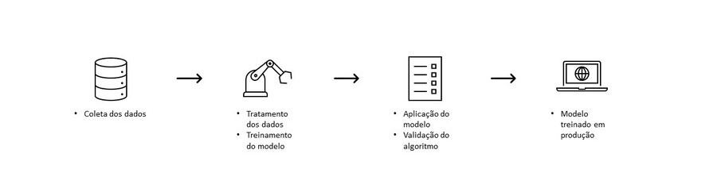

## HS-Airplane

### Introdução:

Este é um projeto end-to-end de Data Science com um modelo de classificação. Tal modelo cria uma previsão de qual é o melhor cartão a ser vendido a partir de comportamentos passados que gera a propensão do melhor plano para futuros clientes. Este projeto faz parte da "Comunidade DS", que é um ambiente de estudo que promove o aprendizado, execução, e discussão de projetos de Data Science.

Importante observar que estes dados são fictícios e usados com intuito de aprendizagem. 

### Plano de desenvolvimento do projeto Data Science

O projeto foi desenvolvido com objetivo de tornar capaz a tomada de decisão através dos dados na empresa e que ocorra de forma assertiva e direcionada.

#### Planejamento

1. Descrição do problema de negócio
2. Plano de solução
3. Modelo em produção
4. Conclusão

### 1. Descrição do problema de negócio

#### 1.1 Objetivo da empresa

A companhia aérea HS-Airplane gostaria de realizar uma campanha de marketing para aumentar o número de passageiros que participam do programa de fidelidade da empresa.

#### 1.2 Problema de negócio

O programa de fidelidade da empresa oferece 3 tipos de benefícios, de acordo com o uso e o engajamento do passageiro com a empresa, ao longo do tempo. Esses níveis de prêmios são representados pelos tipos de cartões de fidelidade. O programa de fidelidade possui 3 cartões de participação: Star, Nova e Aurora. Cada cartão possui níveis de benefícios e prêmios, sendo o Star com menos e o Aurora com mais prêmios. O time de marketing forneceu uma base de novos clientes para o time comercial entrar em contato e fazer a oferta da assinatura do programa de fidelidade. Porém, não há vendedores suficientes no time comercial para abordar todos os clientes, obrigando o time alcançarem altas taxas de compra da assinatura, para baterem a meta. Para alcançar a meta, o time comercial precisa entrar em contato com o cliente, sabendo qual a probabilidade dele assinar o cartão Star, Nova ou Aurora. Assim, o vendedor consegue oferecer o cartão de maior probabilidade, diminuindo o tempo da venda e aumentando a receita, através da oferta do cartão mais adequado para o perfil de uso de cada cliente.

#### 1.3 Missão

Com as informações fornecidas, é necessário realizar uma análise dos dados da companhia aérea, treinar um algoritmo ML que identifique um padrão e tendência nos clientes de comprar um dos cartões da empresa e que este algoritmo forneça essa probabilidade assertiva de compra. Ou seja, tal ação vai entregar aos vendedores uma informação prévia de qual é o cartão ideal a ser oferecido ao cliente, diminuindo assim o tempo de venda, auxiliando o vendedor no cumprimento da meta e aumentando a receita da empresa.

### 2. Plano de solução

#### 2.1 Coleta de dados

- Entendimento do banco de dados
- Linguagem de programação SQL
- Coleta de dados do banco de dados

#### 2.2 Análise de dados

- Inspeção dos dados
- Análise exploratória dos dados (variáveis utilizadas no projeto para construção do algoritmo)
- Preparação dos dados a serem utilizados

#### 2.3 Treinamento do algoritmo de Machine Learning

- Treinamento do algoritmo
- Exposição dos resultados

### 3. Modelo em produção

O modelo de Machine Learning foi implementado e colocado em produção através de uma interface web Gradio (https://www.gradio.app), que permite uma exposição do algoritmo de qualquer lugar por meio de um link da web.

#### Esquemático do modelo em produção

Após este processo, é esperado que o time de vendas da empresa se baseie nos dados do passado e sendo mais assertivos na escolha do cartão a ser oferecido para o cliente, reduzindo tempo de venda e gerando receita a empresa.
Um modelo de execução de escolha de cartão a ser vendido ao cliente é exibido abaixo:

### 4. Conclusão

Neste projeto foi realizado um processo de implementação do projeto em um ambiente de produção. Dentro do método de execução do projeto, utilizou-se o modelo de árvore de decisão, na qual se mostrou satisfatório para a previsão de venda de planos para clientes com comportamento de compra específico de cada segmentação de categoria de cliente.
